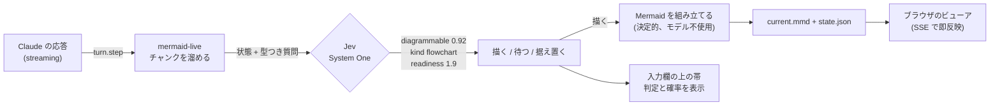
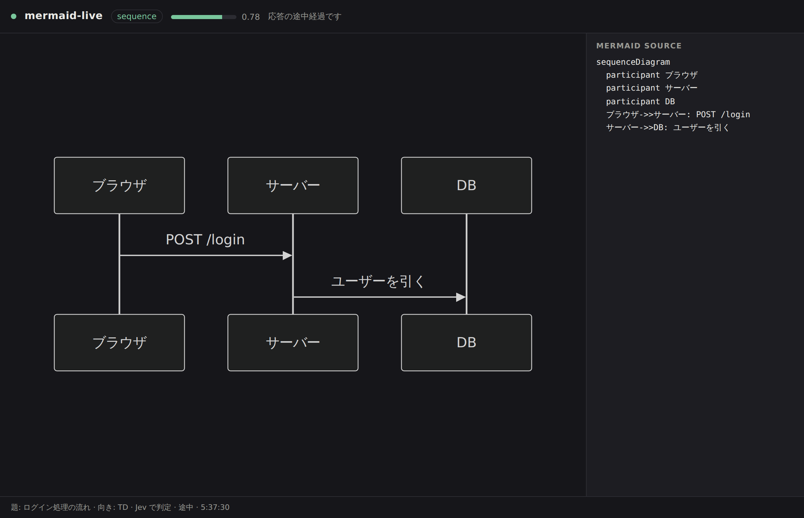
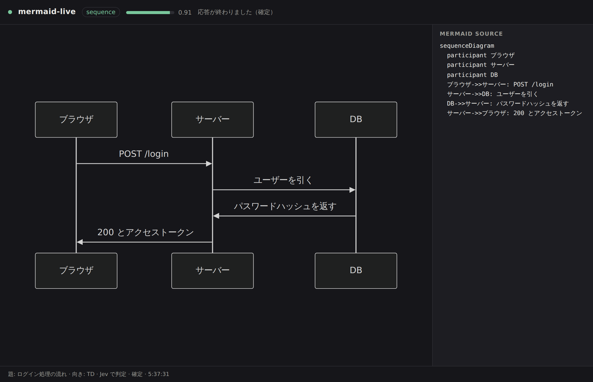
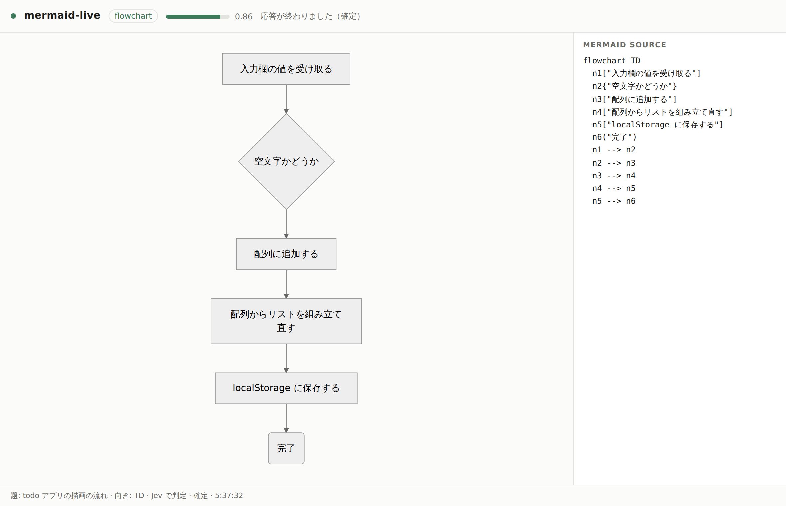

# mermaid-live

Claude の応答を、**書き終わるのを待たずに** Mermaid の図にする Claude Mod。

応答が流れてくる途中で図を出そうとすると、ふつうは「図にするほどの内容か」も
「もう描いていい状態か」も分からないまま描いてしまい、壊れた図がちらつく。
ここでは、その判断だけを [Jev](https://docs.typesafe.ai)（TypeSafe AI の System One モデル）に任せている。
Jev は文章を書かず、型のついた質問に確率で答えるだけのモデルなので、
「0.92 なら描く / 0.31 なら待つ」と**閾値で切れる**。

図の文字列そのものは Jev もモデルも作らない。応答テキストから決定的に組み立てる。
だから途中経過でも構文が壊れない。



## 見た目

応答が伸びるのに合わせて図が育つ。左が材料 2 本の途中、右が応答が終わった時点。

> 図は `extract.ts` → `toMermaid()` が実際に生成したもの。ただし **0.78 / 0.91 という確率は表示例で、Jev が返した値ではない**（撮影時に API キーを持っていないため）。

| 途中経過 | 確定 |
|---|---|
|  |  |

手順を説明した応答なら flowchart になる（種類を選んでいるのは Jev）。



## Jev に聞いていること

1 往復で 4〜5 問まとめて評価する（Jev は並列に答える）。

| id | 型 | 何を決めるか |
|---|---|---|
| `diagrammable` | noul（yes/no の確率） | そもそも図にする価値があるか |
| `kind` | choice | flowchart / sequence / state / mindmap / none |
| `readiness` | score | 途中経過がどこまで描き切れる状態か |
| `direction` | choice | TD か LR か |
| `changed` | noul | 前に描いた図から意味が変わったか（**ちらつき防止**） |

`changed` が効くのが実感しやすい。これが無いと 1 秒ごとに描き直して画面が暴れる。

## 必要なもの

- Claude Code 2.1.27x 以降（**Mods は早期アクセス**）
- Node.js 22.6 以降（ビューアとテスト用。依存パッケージはゼロ）
- 判定に使う System One のエンドポイント。次のどれか:
  - **TypeSafe の Jev**（[console.typesafe.ai/keys](https://console.typesafe.ai/keys)）。早期アクセス、ウェイトリスト制
  - **[OpenJev](docs/openjev.md)** — 同じ API をオープンな重みで話す独立実装。無料のホスト版か、自分の GPU で
  - **何も無し** でも動く。その場合は規則ベースの当て推量で図を出す（帯に「判定なし」と出る）

## 料金

Jev は **$0.042 / 100万入力トークン、出力は $0**（自己回帰的に生成しないので課金対象の出力トークンが無い）。

この Mod の実測では **1000 応答あたり $0.07〜0.32**。1 日 100 応答を毎日使っても月 $1〜3 程度。

```bash
node tools/cost.ts              # 実際に送るリクエストを組み立てて見積もる（通信しない）
node tools/cost.ts answer.md    # 自分の文章で
```

内訳、コストを下げるつまみ、普通の LLM に同じ判定をさせた場合との比較、出典は
**[docs/pricing.md](docs/pricing.md)** にまとめてある。

払うのは、この Mod を動かしているマシンの環境変数に入っているキーの持ち主。
Claude Code の利用料とは別勘定で、TypeSafe から直接請求される。
キーが未設定なら 1 度も呼ばれず、規則ベースで動く（料金ゼロ）。

**お金を払いたくない / ウェイトリストを待ちたくない場合**は、同じ API を話す
[OpenJev](docs/openjev.md) に向き先を変えられる。無料のホスト版（入力 100M トークン、
カード不要）か、自分の GPU で動かす（この場合キーすら要らない）。

## 使い方

### 1. 関数フックを有効にする

`~/.claude/settings.json`:

```json
{
  "env": {
    "CLAUDE_CODE_ENABLE_FUNCTION_HOOKS": "1",
    "TYPESAFE_API_KEY": "ts-...",
    "MERMAID_LIVE_VIEWER": "1"
  }
}
```

このフラグが無いと Mod は**黙って**読み込まれない。

### 2. Mod を読み込む

試すだけなら:

```bash
claude --plugin-dir /path/to/mermaid-live --debug
```

入れっぱなしにするなら、リポジトリのルートに `.claude-plugin/marketplace.json` を置いてあるので、
このリポジトリ自体をマーケットプレイスとして追加できる:

```bash
claude plugin marketplace add vivi-0124/me
claude plugin install mermaid-live@vivi-mods
```

### 3. ビューアを開く

`MERMAID_LIVE_VIEWER=1` なら、セッション開始時に自動で立ち上がる。
手で立てるなら:

```bash
node viewer/server.mjs          # http://127.0.0.1:4737
```

ブラウザを開いたまま Claude に何か聞くと、答えが伸びるのに合わせて図が育つ。

### 4. Claude Code を立ち上げずに見てみる

```bash
node viewer/server.mjs &
npm run demo                    # 用意した応答を 1 行ずつ流し込む
npm run demo -- answer.md       # 自分の文章で試す
```

## 設定（環境変数）

| 変数 | 既定値 | 意味 |
|---|---|---|
| `MERMAID_LIVE_API_KEY` / `TYPESAFE_API_KEY` / `TYPESAFE_AI_API_KEY` | なし | Jev のキー。無ければ規則ベース（[料金](docs/pricing.md)） |
| `MERMAID_LIVE_MODEL` | `jev-latest` | モデル名。OpenJev は `jev-latest` も受けるので、そのままでも動く |
| `MERMAID_LIVE_BASE_URL` | `https://api.typesafe.ai/v1` | [OpenJev](docs/openjev.md) や Vercel AI Gateway に向けるとき。**既定以外を指すとキー無しでも有効になる** |
| `MERMAID_LIVE_DIR` | `.claude/mermaid-live` | `current.mmd` と `state.json` の置き場 |
| `MERMAID_LIVE_PORT` | `4737` | ビューアのポート |
| `MERMAID_LIVE_VIEWER` | なし | `1` でセッション開始時にビューアを自動起動 |
| `MERMAID_LIVE_MIN_GROWTH` | `240` | 前回の判定から何文字増えたら次を聞くか |
| `MERMAID_LIVE_MIN_INTERVAL_MS` | `1200` | 判定の最短間隔 |
| `MERMAID_LIVE_THRESHOLD` | `0.55` | 描き始める確率のつまみ。上げると寡黙に、下げるとお喋りになる |

## 中身

```
hooks/register.ts      Mod 本体。turn.step / ui.render / session.start
hooks/lib/extract.ts   応答テキスト → 図の材料（純関数）
hooks/lib/mermaid.ts   材料 + 種類 → Mermaid ソース（純関数）
hooks/lib/questions.ts Jev に投げる型つき質問
hooks/lib/jev.ts       System One API のクライアント
hooks/lib/decide.ts    確率 → 描く / 待つ / 据え置く
hooks/lib/buffer.ts    チャンクを溜めて、いつ聞くかを決める
hooks/lib/band.ts      入力欄の上の帯
viewer/                依存ゼロのビューア（SSE + Mermaid は CDN から）
tools/demo.ts          Claude Code 抜きで通す
tools/cost.ts          1 応答あたりの Jev のコストを見積もる
docs/pricing.md        Jev の料金と実測コスト
docs/openjev.md        OpenJev（自前 / 無料）に切り替える
```

設計で効いているのは 3 点:

- **ストリームを止めない。** `turn.step` のフックがやるのは文字列の連結だけ。
  Jev への往復と書き出しは別の Promise に逃がしてあり、チャンクはそのまま素通しする。
- **聞きすぎない。** 「前回から N 文字増えた」かつ「M ミリ秒経った」ときだけ聞く。
  時計を見るのもホストへの往復なので、その前に文字数だけで足切りしている。
- **判定エンジンは差し替えられる。** 送っているのは System One のワイヤ API
  （`POST /v1/systemone`）なので、同じ API を話すサーバなら向き先を変えるだけで動く。
  `hooks/lib/jev.ts` がその境界。
- **閉じていない ```mermaid は使わない。** 応答自体が Mermaid を書き始めた場合、
  閉じフェンスが来るまでは未完として扱い、材料から自前で組み立てる。

## 開発

```bash
npm test                              # 60 件（純関数 + Mod の通し試験）
npx tsc -p tsconfig.json              # 型チェック（.claude/types が要る）
claude plugin validate .              # Mod の形と $ の呼び出しを検査
```

`tsconfig.json` が見る `.claude/types/claude-code.d.ts` は、Claude Code の
**セッション内**スラッシュコマンド `/plugin-types` が書き出す。
ビルドごとに再生成されるのでコミットしない（`.gitignore` 済み）。

`npm test` は Claude Code を立ち上げずに Mod 全体を通す。`$` と Jev と
`turn.step` のストリームを偽物に差し替えて `register.ts` をそのまま動かしているので、
チャンクを溜める → Jev に聞く → `.mmd` を書く、の一本道が壊れたら落ちる。

## 既知の制約

- **Mods は早期アクセス。** `$` の形もイベント名もリリース間で変わりうる。
  変わったら `/plugin-types` で型を取り直して `tsc` に通すのが早い。
- **フックには実行時間の予算がある。** Jev の 1 往復には 6 秒で見切りをつけ、
  遅い回はその場で捨てて次のチャンクに任せる。図が出ないより遅れるほうが困る。
- **ビューアは Mermaid を CDN（jsdelivr）から読む。** 外に出られない環境では
  `viewer/index.html` の import を手元のファイルに差し替える必要がある。
- **日本語の抽出は素朴。** 番号付きリスト・箇条書き・`A -> B` の矢印が主な手がかりなので、
  地の文だけで説明された手順は拾いきれない。ここは `hooks/lib/extract.ts` を育てる場所。
- **Jev には料金がかかる。** 1000 応答あたり $0.07〜0.32 の実測。コストは応答の長さに対して二次で伸びる（毎回それまでの本文を送り直すため）。詳細と削り方は [docs/pricing.md](docs/pricing.md)。

## 参考

- Claude Mods の設計と議論: [anthropics/claude-code#91870](https://github.com/anthropics/claude-code/issues/91870)
- Anthropic 自身の Mod: [anthropics/claude-code の `mods/`](https://github.com/anthropics/claude-code/tree/main/mods)
- Jev のドキュメント: [docs.typesafe.ai](https://docs.typesafe.ai)
